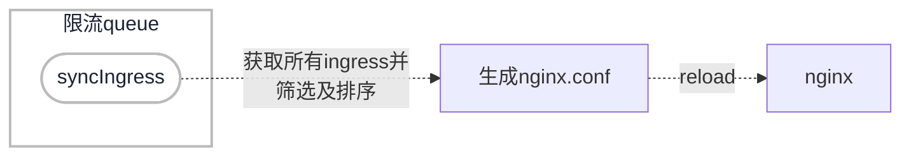

# ingress是如何进行工作的

从官网盗图：

```mermaid
graph LR;
client([1.客户端])-. 2.Ingress-管理的 <br>负载均衡器 .->ingress[3.Ingress];
ingress-->|4.路由规则|service[5.Service];
subgraph cluster
ingress;
service-->pod1[6.1.Pod];
service-->pod2[6.2.Pod];
end
classDef plain fill:#ddd,stroke:#fff,stroke-width:4px,color:#000;
classDef k8s fill:#1a2433,stroke:#fff,stroke-width:4px,color:#fff;
classDef cluster fill:#fff,stroke:#bbb,stroke-width:2px,color:#1a2433;
class ingress,service,pod1,pod2 k8s;
class client plain;
class cluster cluster;
```

### 解析

假设客户端需要通过访问`http://example.com`来访问位于 pod1的资源

1. 客户端键入`http://example.com`,dns服务器解析出ip地址`59.41.164.65`
2. 通过L4层的负载均衡将流量分发至ingress controller，即图中2，3项
3. ingress controller解析路由规则，转发至期望的service
4. service将请求负载至具体pod

### 说明

与作为 `kube-controller-manager` 可执行文件的一部分运行的其他类型的控制器不同， Ingress 控制器不是随集群自动启动的。 

# ingress-nginx内部是如何工作的



### 想要做的事情

ingress-nginx-controller的目的是组装一个配置文件（nginx.conf），在配置文件发生任何更改后需要重新加载 NGINX

#### 如何监控数据变化

k8s controller 使用synchronization loop pattern来检查controller中状态是否已更新或是否需要更新。

Informer/SharedInformer 监视 ingress当前状态的变化，并将事件发送到queue，然后由worker弹出事件进行处理(syncIngress()方法)。

#### 怎样去更新数据变化

由于没办法知道一个特定（Ingresses, Services, Endpoints, Secrets, and Configmaps）的变化是否会影响到最终的配置文件。

每次更改时，我们都必须根据集群的状态从头开始重建新模型，并将其与当前模型进行比较。如果新模型与当前模型相同，那么我们将避免生成新的 nginx 配置并触发重新加载。

如果diff仅与Endpoints相关，使用 HTTP POST 请求将新的Endpoints list发送到在 Nginx 内运行的 Lua 处理程序，并再次避免生成新的 nginx 配置并触发重新加载。

如果diff不止Endpoints，那我们就要重新组装nginx配置了。

#### 如何组装nginx配置

构建nginx配置是极其耗时的操作，所以使用同步循环，通过syncQueue，既可以不丢失change，又可以摆脱sync.Mutex噩梦，来强制同步循环的单次执行。同步循环的开始和结束之间创建一个时间窗口，允许丢弃不必要的更新。

构建模型的操作：

- 按`CreationTimestamp`字段对Ingress 规则进行排序，即旧规则在前。
- 如果在多个 Ingress 中定义了同一主机的相同路径，则最旧的规则获胜。
- 如果多个 Ingress 包含同一主机的 TLS 部分，则最旧的规则获胜。
- 如果多个 Ingress 定义了影响 Server 块配置的注释，则最旧的规则获胜。
- 创建 NGINX 服务器列表（每个主机名）
- 创建 NGINX 上游列表
- 如果多个 Ingress 为同一主机定义了不同的路径，则 Ingress 控制器将合并这些定义。
- 注释应用于 Ingress 中的所有路径。
- 多个 Ingress 可以定义不同的注释。这些定义在 Ingress 之间不共享。

#### 需要重新加载的场景

- 创建新的Ingress。
- 现有 Ingress添加TLS 。
- Ingress 注释的变化不仅仅影响上游配置。例如`load-balance`注释不需要重新加载。
- 从 Ingress 添加/删除path。
- 删除Ingress, Service, Secret。
- 一些来自 Ingress 的缺失引用对象可用，例如 Service 或 Secret。
- 更新了一个 Secret。
